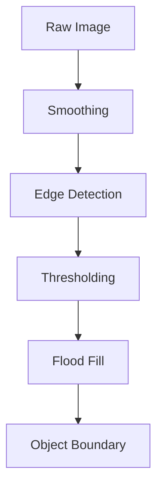
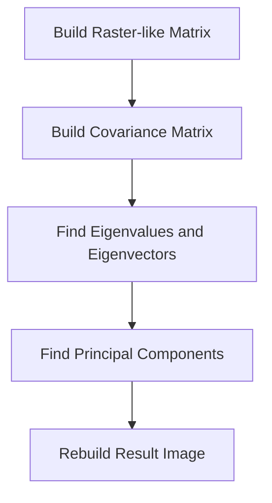

• Background and introduction - 5 %
• Visual feature extraction - 30 %
  -    Preprocess  
  -    Edge detection
  -    Extract features
  -    DCT
  -    Primary Component Analysis  

• Evaluation of classifiers - 30 %

https://cis.temple.edu/~latecki/StudentReports/Roland_CIS751_VideoAnalysisProject.doc

https://tigerprints.clemson.edu/cgi/viewcontent.cgi?article=1615&context=all_dissertations pp..99
Create a raster like matrix for PCA

PCA  
X1 = (x1,x2,...,xNx,xNy)
...
Xt = (x1,x2,...,xNx,xNy)

$$\begin{bmatrix}
x_{1} & x_{2} & ... & x_{1N_{x}N_{y}}\\
x_{N_{t}} & ... & ... & x_{N_{t}N_{x}N_{y}}
\end{bmatrix}$$

subtract mean of each row

Other way, for temporal constant
$$\begin{bmatrix}
x_{11} & ... & x_{1N_{t}}\\
x_{N_{x}N_{y}1} & ... & x_{N_{x}N_{y}N_{t}}
\end{bmatrix}$$
