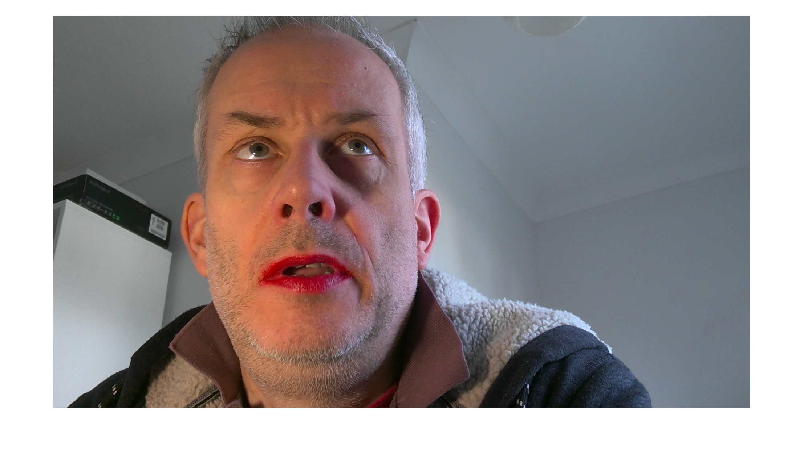
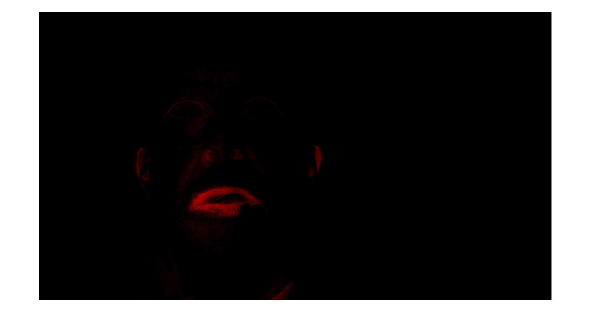
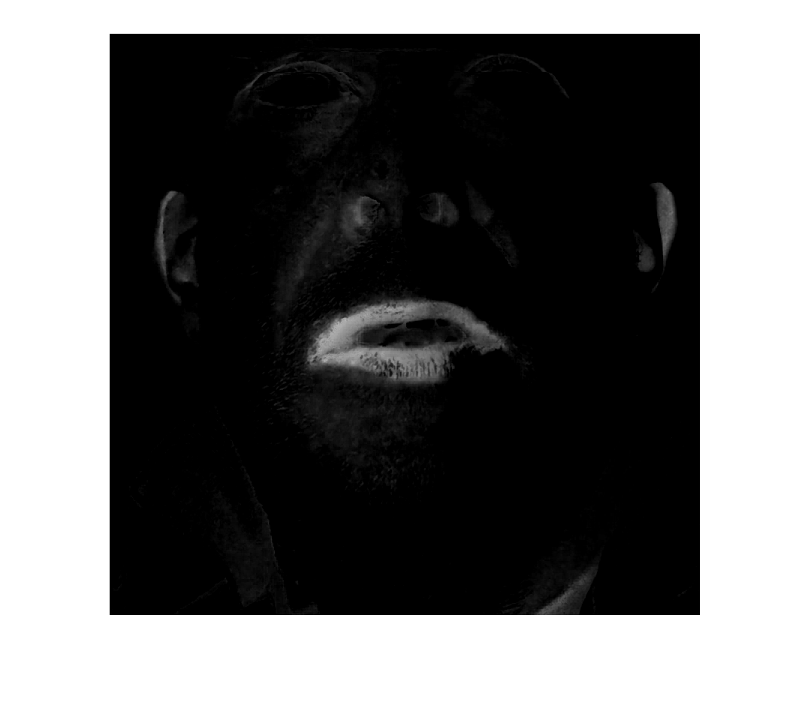
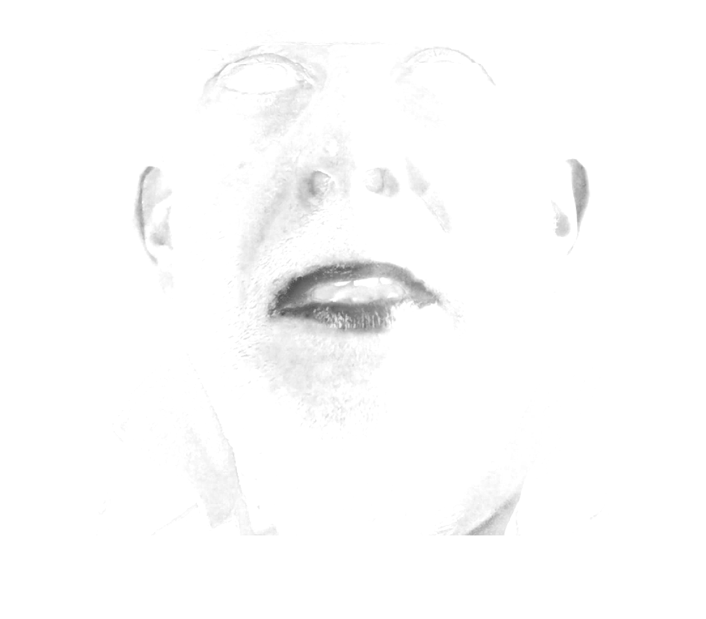
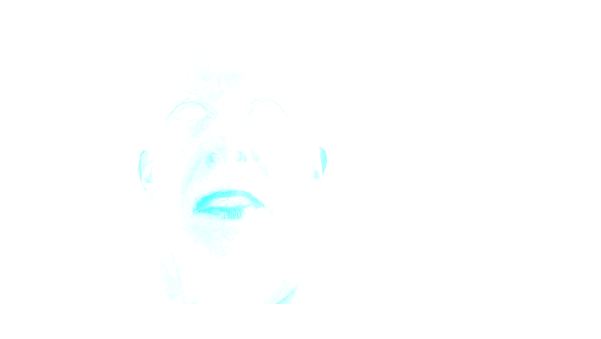
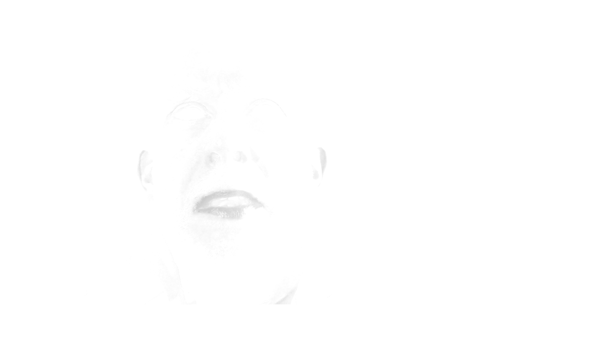

>> % Remove blue and green
>> imshow(img-img(:,:,2)-img(:,:,3));

>> % Crop Image

>> % Get image complement (negative)
>> imshow(imcomplement(img-img(:,:,2)-img(:,:,3)));

<!--
>> % Get image complement (negative)
>> imshow(imcomplement(img-img(:,:,2)-img(:,:,3)));

>> % Convert to grayscale
>> imshow(rgb2gray(imcomplement(img-img(:,:,2)-img(:,:,3))));

imshow(imcomplement(cropedges(img-img(:,:,2)-img(:,:,3))));
-->
